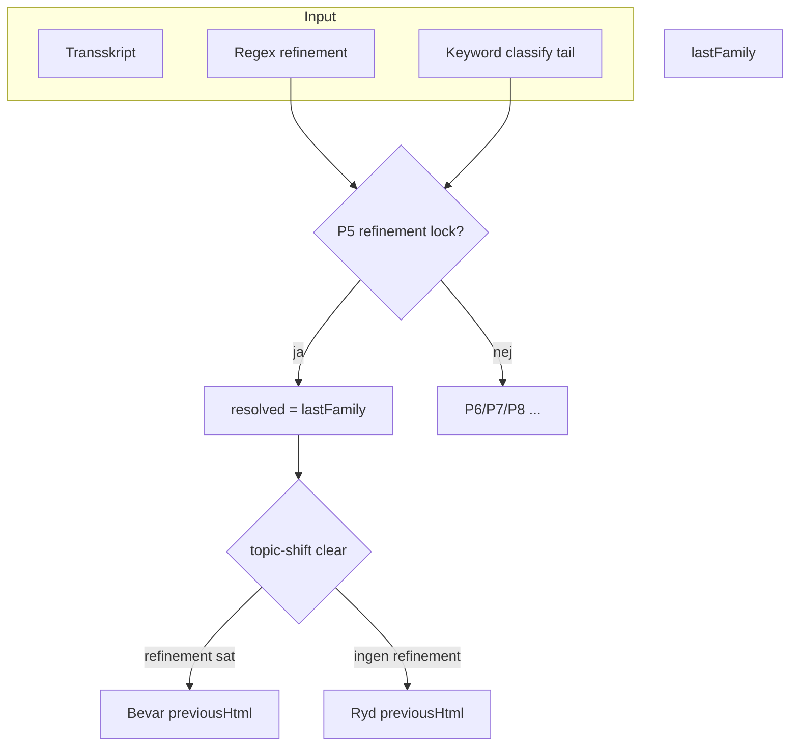
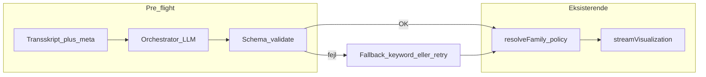

# Plan: Korrekt viz-familie vs. incremental, og dybere kontekst (LLM)

## Diagnose (hvorfor du ser adfærden)

To uafhængige mekanismer i [`artifacts/api-server/src/routes/visualize.ts`](artifacts/api-server/src/routes/visualize.ts) forklarer det meste:

### 1. P5 refinement-lås (`resolveFamily`)

I [`resolveFamily`](artifacts/api-server/src/routes/visualize.ts) (ca. linje 35–106): når **`refinementDetected`** er sand **og** der findes en **`lastFamily`**, returneres **altid** `lastFamily` — **medmindre** P2 `hardOverride` slår til. En “rigtig” ny familie fra keyword-klassifikatoren med høj `lead` **vinder ikke** over låsen.

Det matcher testene i [`run-fictive-route-tests.ts`](artifacts/api-server/src/scripts/run-fictive-route-tests.ts) (R6/R8: “Strategi A”).

### 2. `refinementDetected` kommer fra regex, ikke semantik

[`detectRefinementIntent`](artifacts/api-server/src/lib/refinement-detector.ts) matcher **faste mønstre** på de sidste ~N tegn af transskriptet. **False positives** (fx ord der ligner “focus on”, “forbedre”, danske varianter, eller tillægsord der trigger) giver `refinementDirective` → P5 → **forkert familie bevares**.

### 3. Topic-shift rydder ikke `previousHtml`, når refinement er sat

Samme fil (ca. 529–547): **`effectivePreviousHtml` nulstilles** ved familie-skift **kun når** `!refinementDirective`. Med et refinement-signal (også falsk) **bevares** gammel HTML → [`isIncremental`](artifacts/api-server/src/routes/visualize.ts) forbliver typisk sand sammen med incremental-branches i [`streamVisualization`](artifacts/api-server/src/lib/visualizer.ts).

### 4. Disambiguation-gaten dækker ikke alle “refinement + lav/midt lead”-huller

[`checkDisambiguationGate`](artifacts/api-server/src/routes/visualize.ts):

- `refinement_vs_topic_shift` kræver bl.a. `lead >= CLASSIFY_SWITCH_LEAD` (samme tærskel som P6).
- `uncertain_topic_shift` kræver udtrykkeligt **`!refinementDirective`**.

Derfor: **refinement-signal + familie konflikt + lead under switch** kan ende med **ingen dialog**, **P5-lås**, og **ingen topic-shift clear** — præcis “det blev incremental selv om familien burde skifte”.

### 5. “Reasoning” om familie er i praksis keyword-score + kort vindue

Klassifikation kører på et **ord-vindue** (fx seneste ~280 ord) af **normaliseret** tekst — ikke fuld semantisk læsning af hele mødet. Det er hurtigt og deterministisk, men **svagt** på nuancer, dansk tale og “hvad arbejder vi på **nu**”.

---

---

## Retning A — Hurtige, lav-risiko policy-rettelser (uden ekstra LLM)

**Mål:** Færre false positives og færre “låst forkert familie”.

1. **Når klassifikatoren er entydig ny familie med `lead >= CLASSIFY_SWITCH_LEAD` og `classification.family !== lastFamily`:** ignorér eller **nedprioritér** refinement-lås (eller kræv højere refinement-`confidence` end “medium”), så P6 kan vinde — **eller** altid kør topic-shift clear selv ved refinement når familie konflikter (strammere end i dag).
2. **Udvid `checkDisambiguationGate`:** Tillad `uncertain_topic_shift` (eller ny årsag) **også når** `refinementDirective` er sat, men familie og lead ligger i “grå zone” — så brugeren vælger fresh/refine i stedet for stille lås.
3. **Finjustér [`refinement-detector.ts`](artifacts/api-server/src/lib/refinement-detector.ts):** tilføj **negation**/kontekst (dansk), højere vægt-tærskel, eller “kun hvis sætning også indeholder opdaterings-verber i forhold til *diagram/viz*”.
4. **Øg observabilitet:** log struktureret `resolvedFamily`, `classification.family`, `lead`, `refinementDirective`, om topic-shift clear kørte — så I kan verificere i prod/logs.

*Opdater [`run-fictive-route-tests.ts`](artifacts/api-server/src/scripts/run-fictive-route-tests.ts) hvis I ændrer P5/P6-præcedens.*

---

## Retning B — “Dyb intelligens”: LLM som routing / kontekst (mellem omkostning og kvalitet)

**Mål:** Bedre forståelse af **helhed** og **aktivt arbejdsemne** uden at sende hele 50k tokens hver gang.

### B1. Billig routing-call (anbefalet først)

- **Én lille LLM** (eller samme model, lav `max_tokens`) med **struktureret output** JSON:  
  `{ vizFamily, confidence, isRefinement, refinementSummary?, currentFocus, reason }`  
  på grundlag af:
  - seneste X minutters transskript **+** kort **rule-based summary** (eller eksisterende [`meeting-essence`](artifacts/api-server/src/lib/meeting-essence.ts) payload fra [`roomToMeetingEssencePayload`](artifacts/api-server/src/lib/meeting-essence.ts)),
  - `lastFamily` + evt. ét afsnit om sidste viz-overskrift.
- **Policy:** LLM-routing **overskriver** eller **vægtes mod** keyword-`resolveFamily` kun når LLM `confidence` > tærskel, ellers fallback til nuværende (sikkerhedsnet).
- **Integration:** nyt skridt i [`visualize.ts`](artifacts/api-server/src/routes/visualize.ts) *før* `resolveFamily`, eller erstat del af logikken når `vizType === "auto"`.

### B2. Løbende “running summary” (tungere)

- Periodisk (fx hver N segmenter eller ved viz): opdater **kompakt bullet-summary** i DB/room-state via LLM; injicér i viz-prompt og i classifier-input.  
- **Fordele:** Bedre “helhed”; **ulemper:** ekstra kald, staleness, mer kompleks tilstand.

### B3. Kun ved gate / konflikt (billig hybrid)

- Kald LLM **kun** når: `refinementDirective && classification.family !== lastFamily`, eller keyword `ambiguous`, eller lav lead — for at afgøre `fresh vs refine` og målfamilie.

---

## Retning C — “Fuld” LLM der forstår mere og håndterer API-ind/ud (hvad der *kan* og *ikke kan*)

**Kort svar:** Ja, du kan lægge en **stærkere / større kontekst** ind (hele eller næsten hele mødet + sidste viz-meta), så modellen tager **én samlet beslutning** om fx familie, incremental vs fresh, og evt. visualiserings-parametre. Men **“sikrer korrekt API input og output”** i ingeniørforstand kræver **ikke** kun LLM — det kræver en **kontrakt uden for modellen**:

1. **Input til API/et:** Struktureret payload (JSON) som **parses og valideres** på serveren (fx Zod/JSON Schema der matcher jeres eksisterende route-body). Ugyldigt felt → afvis eller clamp, **ikke** send blindt videre til Claude viz-stream.
2. **Output fra viz-LLM:** Bevar nuværende sanitization/streaming — evt. **let post-check** (fx at der findes én komplet HTML-struktur, ingen tom body ved success), og **retry med kort fejlfeedback** ved parse/skeleton-fejl. En “fuld” forståelses-LLM **garanterer ikke** perfekt HTML; den **reducerer** logiske fejl i *beslutningen* før hovedkaldet.
3. **Hvor i pipeline:** Typisk **før** `resolveFamily` / `streamVisualization`: ét kald der returnerer `{ resolvedFamily, isIncremental, refinementEffective, rationale }` (eller rigere), som derefter **tvinger** resten af koden ned ad én gren — så keyword+regex kan blive ren fallback.

**Realistiske ulemper:** højere **latency og omkostning** pr. viz hvis I altid kører C; risiko for **drift** (modellen ændrer mening mellem versioner) — derfor **versionér prompts** og hold **policy A** som jordslået fallback.

**Praktisk anbefaling:** Implementér **A (+ evt. B3)** først; tilføj **C** kun hvis I måler at routing stadig fejler efter bedre policies, *og* I accepterer prisen for ekstra kald.

---

## Afhængigheder og risici

- **Latency/omkostning:** Hver routing-call tilføjer 200ms–få sekunder + tokens; B3 minimerer det.
- **Konsistens:** Nye LLM-beslutninger skal **spejles** i meta-events til frontend (allerede `meta` med classification/refinement).
- **Test:** Udvid fictive tests for **ny** præcedens hvis I ændrer P5; tilføj golden tests for LLM-json med mock.

---

## Anbefalet rækkefølge

1. **Retning A** (policy + refinement-finurl + gate-hul) — hurtig effekt, laveste risiko.  
2. **Retning B3 eller B1** — hvis I stadig vil have semantisk “forståelse” efter A.  
3. **B2** — kun hvis specialet / produktet kræver fuld møde-hukommelse.  
4. **Retning C** — kun hvis I vil betale latency/tokens for **samlet orkestrering + hård skemavalidering**; stadig **ikke** erstatning for validering i kode.
