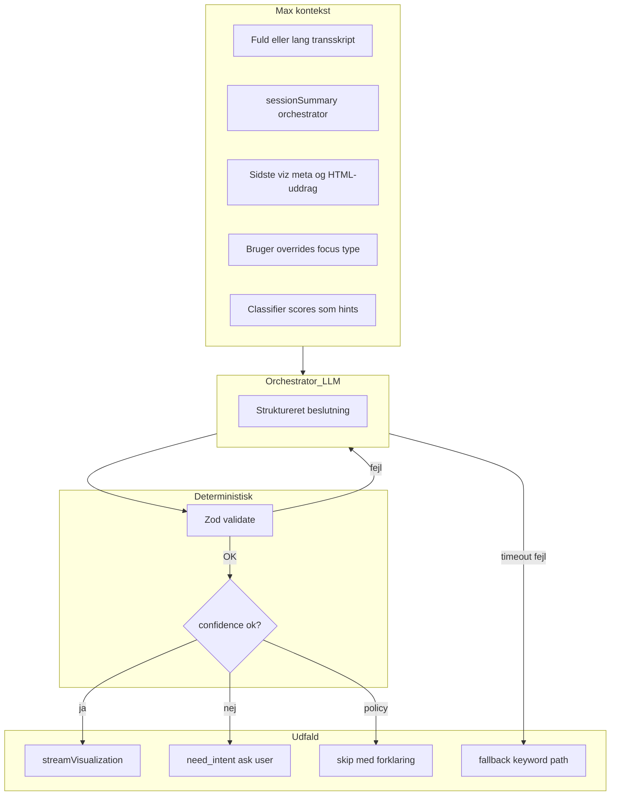

# Total kontekst og orkestrering (agent-niveau)

## Mål og realitet

**Ønske:** Logik, kontekst og reasoning skal være **så komplet som muligt**, så **tvivl minimeres**—på linje med høj-niveau styring i Cursor, Claude Projects eller Replit-agent: én “chef” der forstår helheden og **træffer eller foreslår** næste skridt.

**Realitet i software:** Ingen model kan **matematisk garantere** nul tvivl hver gang. Det I kan levere er **operativ totalitet**:

- **Én orchestrator** med **maksimal kontekst** (lang transskript + vedligeholdt session-resumé + sidste viz-titel/familie + bruger-kontekst).
- **Struktureret output** der **valideres** i kode; ugyldigt → retry med fejl til modellen eller fallback.
- **Eksplicit “spørg brugeren”**-gren når `confidence` under tærskel (så “tvivl” bliver **handling**, ikke stille forkert state).
- **Synlig rationale** til facilitator (som agent-“thinking”) for tillid og fejlsøgning.

Det er et skift fra **“keyword først, LLM i hjørnet”** til **“orchestrator først, keyword som hint/værktøj”**.

---

## Nuværende arkitektur (begrænset reasoning)

Se [artifacts/api-server/src/routes/visualize.ts](artifacts/api-server/src/routes/visualize.ts) og [artifacts/api-server/src/lib/llm-router.ts](artifacts/api-server/src/lib/llm-router.ts): hovedflow er stadig **klassifikator + regex + resolveFamily**; Gemini-router kører **kun** når disambiguation-gaten allerede har åbnet. Det efterlader P8, `ambiguous_no_context` og svag essens **uden** fuld semantisk gennemgang.

---

## Målarkitektur: Orchestrator-centric

**Princip:** Orchestratoren returnerer **én autoritativ beslutning** for auto-mode:

- `vizFamily`, `mode`: `fresh` | `refine` | `skip` | `ask_user`
- `refinementNote` (hvis refine), `confidence`, `rationale` (kort, til UI/logs)
- valgfrit `sessionSummaryUpdate` (4–8 linjer) der **persisteres** og bruges næste gang (erstatter keyword-essens som primær lang hukommelse over tid)

**Keyword-klassifikator:** Bevares som **input-hint** til orchestratoren og som **fallback** hvis orchestrator fejler — ikke som prima facie sandhed.

**Separat API/model:** Orchestrator bør kunne køre på **egen** model/nøgle (fx `ANTHROPIC_API_KEY` med lille/klog model eller dedikeret `ORCHESTRATOR_MODEL`), så den ikke konkurrerer unødigt med HTML-streaming-worker og så I kan versionere “chef”-prompt uafhængigt af viz-prompt.

---

## Faser (så I kan skibe uden big bang)

1. **Fase A — Kontrakt og modulet:** Schema + `orchestratorVizDecision()` + logger; feature-flag `ORCHESTRATOR_VIZ` default off.
2. **Fase B — visualize-integration (auto-only):** Før `resolveFamily`, når flag on: kald orchestrator → map output til `resolvedFamily`, `effectivePreviousHtml`, `refinementDirective` (eller null), skip/generate; lav `confidence`-gren til `ask_user`.
3. **Fase C — Session memory:** Persistér `sessionSummaryUpdate` på room/DB; injicer i orchestrator + [meeting-essence / visualizer](artifacts/api-server/src/lib/meeting-essence.ts) input.
4. **Fase D — UX:** SSE `meta.orchestrator: { rationale, mode, confidence }`; valgfrit facilitator-panel.

Senere (valgfrit, “tredje lag”): **tool-use** — orchestrator kalder internt “get_keyword_scores” eller “get_last_artifacts” som i rigtige agenter; ikke nødvendigt for første “total reasoning”-oplevelse.

---

## Hvad der sker med den tidligere “incrementelle” plan

De tidligere punkter (LLM før `ambiguous_no_context`, grå zone, berig tail) **absorberes** i orchestratoren: den ser **hele konteksten** og behøver ikke fire ad hoc triggers. De kan stadig implementeres som **midlertidige** forbedringer før Fase B er klar, hvis I vil have hurtig wins parallelt.

---

## Risici (kabinet-niveau)

- **Latency:** +1 orchestrator-kald pr. viz → budgetér *parallelt* med streaming-start eller accepter forsinkelse; brug hurtig orchestrator-model.
- **Omkostning:** Fuld kontekst = flere tokens; summary-felt holder tokenvækst nede efter første iterationer.
- **Drift:** Versionér orchestrator-systemprompt og schema; golden tests med mocks.
- **Fail-closed:** Timeout → fallback til nuværende pipeline eller eksplicit “kunne ikke beslutte — vælg type”.

---

## Afkrydsning (succeskriterier)

- Auto-mode: **alle** viz-forsøg går gennem valideret orchestrator-beslutning eller dokumenteret fallback.
- Ingen stille “P8 forkert familie” uden at orchestrator (eller bruger) har **valgt** inertia.
- Logs: ét trace med orchestrator input-hash + output + tærskel-udgang.
- Facilitator kan læse **hvorfor** i UI.
